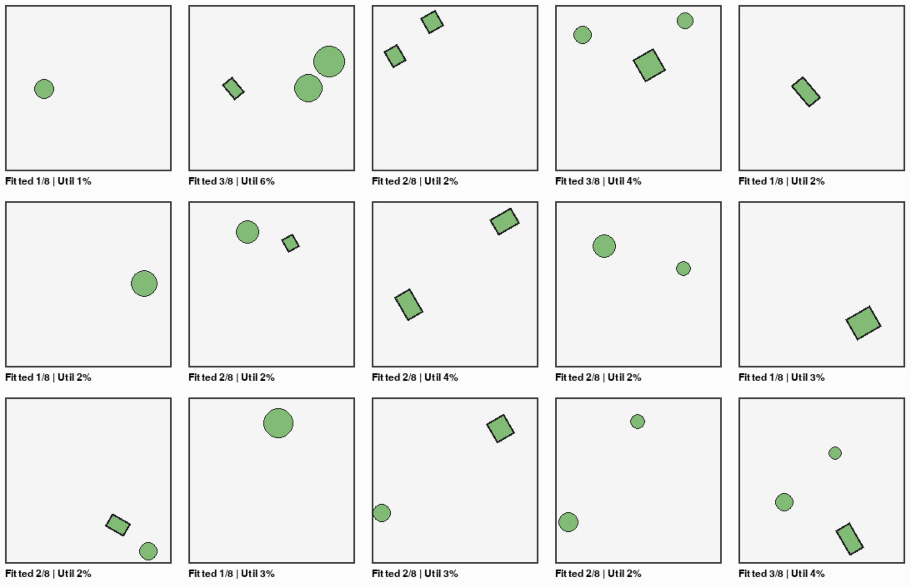

# Shape Packing RL

This project trains an agent to pack 2D shapes into a container using RL. The agent selects a shape, a position (x, y), and a discrete rotation (18 options). The goal is to place as many shapes as possible without collisions.

Overview
- Environment (`env.py`): rectangle or custom polygon container; actions: [shape_id, x, y, rotation_index]; observations: compact features + 10x10 occupancy grid; rewards primarily for successful placements.
- Agent (`agent.py`): PPO with mixed discrete/continuous actions; outputs scale with container size.
- Shapes (`shapes.py`): rectangles, circles, triangles, L-shapes, irregular polygons.

Install
```bash
pip install -r requirements.txt
```

Train (minimal)
```bash
python train_simple.py
```

Live visualization (5x5 with online PPO)
```bash
python train_viz_grid.py
```

Saving images
- To save per-step images, create the environment with `save_images=True`. Images are saved to `images/run_<timestamp>/`.

Testing
```bash
pytest
```

Example run

